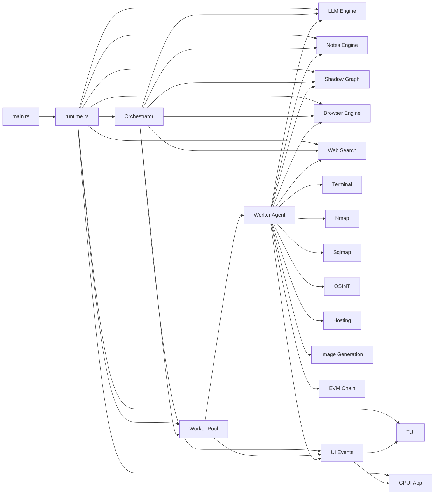
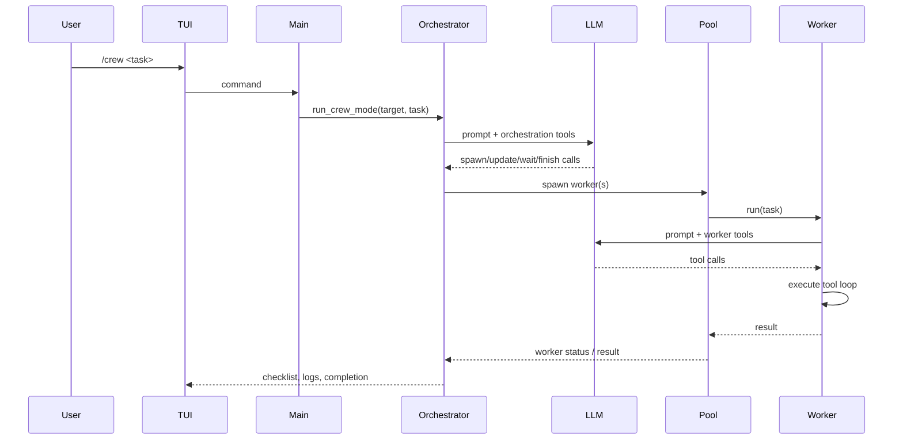

# Serpantoxide Architecture

Serpantoxide is a compact argument against accidental complexity. It does not pretend to be a general-purpose agent platform, nor does it dissolve into the usual sludge of indirection for its own sake. It is an offensive-security runtime with a small number of essential concerns: think, delegate, execute, remember, display, and report. Everything in the codebase is answerable to one or more of those verbs.

## Architectural Thesis

The Python implementation proved that a multi-agent penetration-testing workflow was useful. It also demonstrated, with the eloquence of a systems failure, that orchestration, browser control, and concurrent worker management are the very places where dynamic ambiguity becomes tiresome. Serpantoxide answers by moving those concerns into Rust while preserving the operational model:

- an LLM orchestrator directs the mission
- autonomous workers pursue bounded subtasks
- native tools perform the work
- a terminal UI exposes telemetry rather than soothing fiction

## System Overview

## Core Components

## 1. Bootstrap and Shared State

`src/main.rs` is now mostly a frontend selector and bootstrap point. It loads environment state, boots the shared runtime, and chooses which interface to launch.

`src/runtime.rs` is the actual assembly hall. Its responsibilities are straightforward:

- create the typed command and event channels
- load configuration and environment variables
- construct the LLM, notes, search, graph, browser, and worker pool
- instantiate the orchestrator
- assemble `RuntimeSnapshot`
- route `RuntimeCommand` values such as target changes, agent runs, crew runs, report generation, and shutdown

The important thing is not that `main.rs` is clever. It is not. The important thing is that it is explicit.

## 2. The TUI

`src/tui.rs` renders the system as an operational console rather than a chat box with delusions of grandeur. The interface has four practical duties:

- show LLM status, model selection, and token telemetry
- display a topology intelligence summary derived from the shadow graph
- present execution logs and crew checklist state
- expose worker state, loot, tool timelines, and detail panes
- open a dedicated topology explorer with host selection, peer-relationship canvas, findings, and fullscreen mode

The topology surface now has two layers:

- a compact summary strip in the main console
- an interactive explorer that can run as a modal or fullscreen workspace

That second layer matters. A topology worth anything must be explorable, not merely printable.

The TUI now listens on the shared typed event stream defined in `src/events.rs` and driven by `runtime.rs`.

At present the event model is intentionally narrow:

- `log`
- `checklist`
- `crew_complete`
- `worker_spawn`
- `worker_status`
- `worker_output`
- `worker_tool`

This is still disciplined, but it is no longer artificially starved. Once the UI grew clickable workers, live tool timelines, and a topology explorer with focusable panels, structured events became the difference between a console and a superstition.

## 3. The GPUI Shell

`src/gpui_app.rs` is an experimental macOS-native shell over the same runtime service.

- it is launched explicitly with `--gpui` or through the packaged `.app` bundle
- it consumes the same runtime snapshots and commands as the TUI
- it is not yet the default CLI surface because a native shell that cannot reliably outclass the TUI should not pretend otherwise

## 4. The LLM Engine

`src/llm.rs` provides the LLM boundary. It does four things:

- loads the selected model from config
- calls OpenRouter for chat completions and tool calls
- tracks latency and token telemetry
- falls back to a deterministic mock mode when the API key is absent

This mock path is not decorative. It enables UI work, orchestration work, and tool-loop verification without requiring live model traffic. In other words, the code can still be tested when the internet or the budget refuses to cooperate.

## 5. The Orchestrator

`src/orchestrator.rs` is the crew-level state machine. It is responsible for:

- building the crew prompt from target, graph hints, and note categories
- invoking the LLM with orchestration tools
- updating the visible checklist
- spawning workers in parallel
- waiting for workers and reading their status
- synthesizing the final outcome

It operates in a bounded loop rather than wandering indefinitely through a swamp of self-generated reflection. The orchestrator’s tool surface is deliberately small:

- `spawn_agent`
- `wait_for_agents`
- `get_agent_status`
- `cancel_agent`
- `formulate_strategy`
- `update_plan`
- `finish`

That limitation is a virtue. Strategic layers should delegate and decide; they should not indulge in manually clicking buttons or parsing shell output line by line.

## 6. The Worker Pool

`src/pool.rs` is the execution broker. It owns worker records, Tokio tasks, and dependency handling. Each worker has:

- an ID
- task text
- status
- logs
- loot
- result or error
- tools used
- tool history with arguments and results
- priority
- dependency list
- timestamps

The pool does not attempt metaphysics. A worker is queued, running, finished, errored, or cancelled. It can also wait on dependencies before execution. The orchestration of dependencies is coarse-grained, but it is real, and that matters more than ornamental sophistication.

The pool also adapts forced task prefixes. If the orchestrator or operator issues `NMAP: target` or `EVM: action`, the pool rewrites that into natural-language guidance so the worker agent can still operate inside its normal planning loop.

## 7. The Worker Agent

`src/worker_agent.rs` is the principal instrument of autonomy in the Rust system. A worker:

1. asks the LLM to create a concise plan
2. renders that plan into a prompt
3. receives tool calls
4. executes those tools natively
5. marks steps complete, skipped, or failed
6. replans if a failure invalidates the original sequence
7. returns a final summary

This is the decisive architectural distinction between the old one-shot worker model and the current design. Workers are no longer glorified shell wrappers. They are iterative agents with bounded autonomy and visible state transitions.

### Worker Step Model

Each plan step has:

- `id`
- `description`
- `status`: `Pending`, `Complete`, `Skip`, `Fail`
- `result`

That small enum does more useful work than many systems manage with a cathedral of classes.

## 8. Tooling Layer

Workers execute native tools. Each tool is intentionally narrow:

### `terminal.rs`

Shell execution with optional working directory, stdin injection, and privilege escalation.

### `browser.rs`

Native browser control through `chromiumoxide`, supporting:

- navigation
- screenshots
- content extraction
- link enumeration
- form enumeration
- selector click
- selector typing
- JavaScript execution

### `nmap.rs`

Fast discovery wrapper with lightweight parsing for service extraction.

### `sqlmap.rs`

Injection-check wrapper with vulnerability extraction.

### `web_search.rs`

Tavily-backed target intelligence lookup.

### `notes.rs`

Persistent note store in `loot/notes.json`, keyed by category and optionally by durable note key.

### `graph.rs`

A lightweight directed graph used to derive strategic hints, topology summaries, peer relationships, and interactive explorer snapshots from accumulated findings.

### `osint.rs`

Bridges to `holehe`, `sherlock`, and `theHarvester`.

### `hosting.rs`

Starts a local HTTP server for staged content or generated artifacts.

### `image_gen.rs`

Calls Google image-capable models and writes PNG output into `loot/images/`.

### `evm_chain.rs`

Provides EVM RPC and explorer-backed analysis, including balances, logs, bytecode, ABI lookup, proxy resolution, and transaction decoding.

## Control Flow

## Mission Flow

## Data Flow

The data model is intentionally plain:

- the LLM engine deals in chat messages and tool calls
- the orchestrator deals in checklist strings and worker IDs
- the worker agent deals in plan steps and tool results
- the graph deals in hosts, services, credentials, vulnerabilities, findings, and derived host relationships
- the note store deals in persistent evidence and metadata

This is not because the domain is simple. It is because the implementation has, so far, resisted the temptation to dignify every string with a thesis-length type wrapper.

## Persistence and State

There are only a few durable pieces of state:

- `.serpantoxide_config` for the selected model and last target
- `loot/notes.json` for persistent notes
- `loot/images/` for generated imagery
- `loot/artifacts/screenshots/` for captured browser evidence

Everything else is in-memory session state:

- worker registry
- logs
- checklist state
- graph contents
- current browser page

This division is sane. Findings persist. Operational chatter does not.

## Concurrency Model

Serpantoxide relies on Tokio throughout:

- the TUI runs asynchronously and receives UI events over a channel
- workers are spawned as Tokio tasks
- shared mutable state lives behind `Arc<RwLock<...>>`
- blocking subprocess execution is isolated through `spawn_blocking`

This is not lock-free wizardry, and one should be grateful for that. The system prefers comprehensible concurrency over heroic nonsense.

## Configuration and External Dependencies

### Core dependencies

- `tokio`
- `ratatui`
- `crossterm`
- `reqwest`
- `serde` / `serde_json`
- `petgraph`
- `chromiumoxide`

### External tools

Some worker tools call local binaries:

- `nmap`
- `sqlmap`
- `holehe`
- `sherlock`
- `theHarvester`
- `python3` for lightweight hosting

The code degrades in some places when those binaries are absent. For example, `nmap` and `sqlmap` have mock fallbacks. This is convenient for development and somewhat dangerous for self-deception if forgotten in production.

## Architectural Strengths

- Clear separation between mission control and task execution
- Native tool execution without Python glue in the hot path
- Transparent UI telemetry
- Durable note and graph feedback loops
- Deterministic mock mode for development
- Bounded worker autonomy rather than theatrical infinity

## Architectural Limitations

The code is competent, but not yet immaculate.

### 1. Event model is sparse

UI events are still mostly log-centric. More structured event granularity would make the interface less dependent on textual convention.

### 2. Graph intelligence is deliberately primitive

`graph.rs` extracts hosts, services, credentials, and vulnerabilities, but its reasoning layer is still more sketch than dissertation.

### 3. Tool wrappers are pragmatic, not exhaustive

Several wrappers expose the valuable 20 percent of a tool’s capability that delivers 80 percent of operational utility. That is sensible, but it is not the same as completeness.

### 4. Prompt policy lives in code

`prompts.rs` centralizes prompt text, which is helpful, but the system does not yet externalize prompt versioning, testing, or policy control in a formal way.

## Extension Points

If you need to extend Serpantoxide, the principal seams are:

- add a new native tool module in `src/`
- register it in `worker_agent.rs`
- document it in `prompts.rs`
- optionally add a forced prefix in `pool.rs`
- emit richer UI events if the TUI needs structured state

The pattern is refreshingly direct.

## Architectural Conclusion

Serpantoxide is a purposeful consolidation of the parts of PentestAgent that most urgently benefit from discipline: orchestration, concurrency, UI state, and native tooling. It is not yet a finished doctrine. It is, however, a serious foundation. In software as in politics, that is rarer than the brochures suggest.
